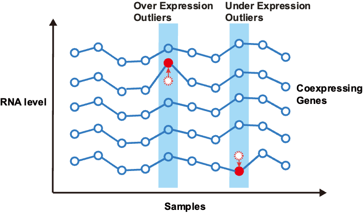

# AXOLOTL
## AXOLOTL: an accurate method for detecting aberrant gene expression in rare diseases using co-expression constraints.


We propose a novel unsupervised method AXOLOTL to identify aberrant gene expression events in RNA expression matrix. The method is useful for rare disease diagnosis.
AXOLOTL effectively addresses biological confounders by incorporating co-expression constraints. The manuscript is being submitted to peer review jounrnals Jan 2024. 

# prepare software enviroment
We recommend to run AXO in docker enviroments. Create two docker image enviroments as follows:
1. R enviroment named 'r4.2:jammy':
install OUTRIDER in R-4.2 using Dockerfile. 
```shell
cd ubuntu22_r4_outrider
docker build --tag r4.2:jammy .
```

2. python enviroment named 'py3'
install OutSingle and AXOLOTL python enviroment using Dockerfile. They is mainly implemented in python, thus data analysis modules (numpy, pandas, etc.) are needed. 
```shell
cd ../py3_outsingle 
docker build --tag py3 .
```

# Example Usage
Demo cohort have 1000 genes x 36 samples. 
Input: A RNA-seq expression matrix /testdata/df_cts.txt. 
Output: A aberrant score matrix /test/df_cts.txt.

Run AXO on demo data as:
```shell
bash script/demo.sh
```

# more information
You may also have interest on https://github.com/gagneurlab/OUTRIDER & https://github.com/esalkovic/outsingle.